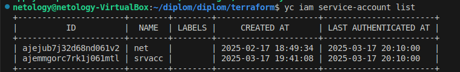
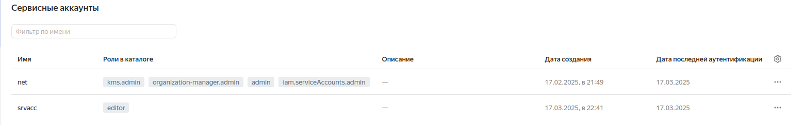
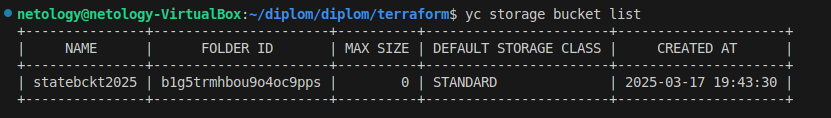
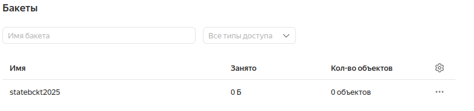
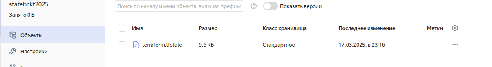
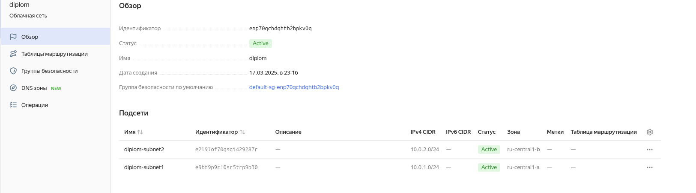
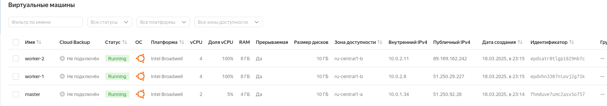
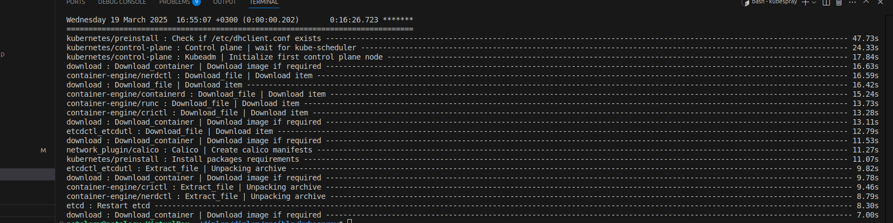
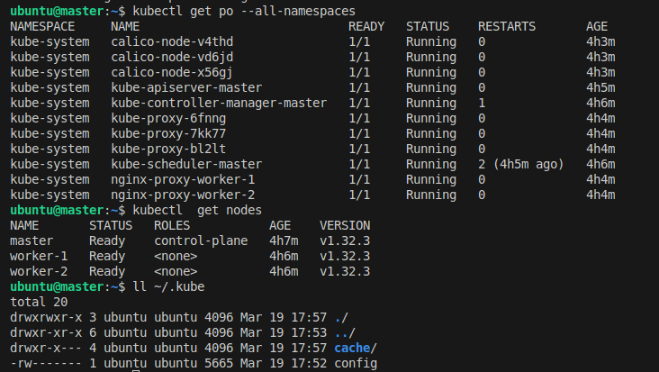

### Создание облачнйо инфраструктуры

Сервисный аккаунт

s3 bucket

тф конфиг с с сохранением стейта в подгтовленном бакете

vpc

terraform apply destroy -auto-approve отрабатывают

### Создание K8S кластера

Подготовка нод

установка k8s кластера, через ansible роль, с подготовленным через терраформ конфиг темплейтом для передачи адресов вм

создан конфиг и проверена работоспособность кластера.

### Создание тестового приложения

